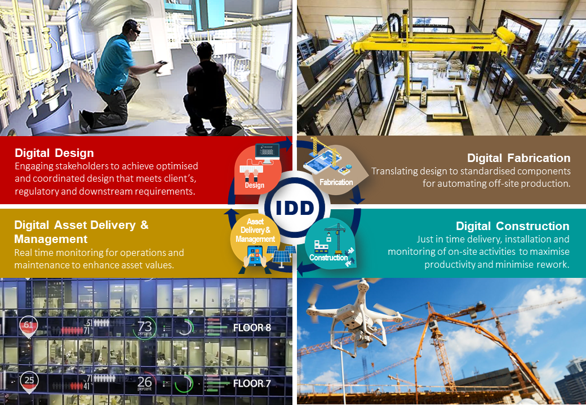

# Building Construction Technologies

We live in an interesting era of building design and construction technologies. Learn more here!

### IDD (Integrated Digital Delivery)

According to the Building and Construction Authority Singapore, the use of IDD (Integrated Digital Delivery) is increasingly implemented to better accelerate the work we do as architects and builders in our built environment.

Integrated Digital Delivery (IDD) is the use of digital technologies to integrate work processes and connect stakeholders working on the same project throughout the construction and building life-cycle. This includes design, fabrication and assembly on-site, as well as the operations and maintenance of buildings.

<figure><figcaption></figcaption></figure>

**Read more about IDD:**

[Integrated Digital Delivery (IDD)](https://www1.bca.gov.sg/buildsg/digitalisation/integrated-digital-delivery-idd)

### Building Information Modelling (BIM)

BIM is a digital representation of a building or infrastructure project that encompasses both graphical and non-graphical information. BIM software allows architects to create intelligent 3D models that contain detailed information about the building's components, materials, systems, and performance attributes. BIM facilitates collaboration among different project stakeholders and improves the accuracy and efficiency of the design and construction process. When creating construction drawings and specifications using BIM, architects can extract relevant information from the model to generate detailed drawings, schedules, quantities, and specifications.

[Software & Tools for Architects](https://www.notion.so/Software-Tools-for-Architects-6fa3aa6478944c9080937e1423cfd178?pvs=21)

### Precast Systems

Precast systems refer to a construction method where building components, such as walls, columns, beams, and slabs, are manufactured off-site in a controlled factory environment. These precast elements are then transported to the construction site and assembled to form a complete structure. Precast systems offer numerous advantages, including improved construction speed, enhanced quality control, reduced labor requirements, and increased durability. The use of precast systems allows for efficient and precise manufacturing of building components, resulting in faster project completion, minimized on-site disruptions, and the potential for cost savings.

### Prefabricated Bathroom Unit (PBU)

Prefabricated bathrooms units or PBU are complete bathroom units that are manufactured off-site and then transported to the construction site for installation. These pre-assembled modules typically include fixtures, fittings, plumbing, electrical systems, and finishes. Prefabricated bathrooms offer several benefits in the construction industry, including reduced construction time, improved quality control, enhanced cost efficiency, and minimized on-site labor requirements. By being manufactured in a controlled factory environment, prefabricated bathrooms can achieve higher precision and consistency in terms of design and construction quality. The off-site construction also allows for concurrent work, where site preparation and foundation work can progress simultaneously with the production of bathroom pods, leading to time savings. Once delivered to the site, prefabricated bathrooms are quickly installed, reducing on-site construction time, and improving project efficiency.

Learn more about PBU:

[Prefabricated Bathroom Unit](https://www1.bca.gov.sg/buildsg/productivity/design-for-manufacturing-and-assembly-dfma/prefabricated-bathroom-unit)

### Prefabricated Prefinished Volumetric Consruction (PPVC)

.png>)

Image credit: Stacked Homes

Prefabricated Prefinished Volumetric Construction (PPVC) is a construction method whereby free-standing 3-dimensional modules are completed with internal finishes, fixtures and fittings in an off-site fabrication facility, before it is delivered and installed on-site.

**Learn more about PPVC:**

[Prefabricated Prefinished Volumetric Construction (PPVC)](https://www1.bca.gov.sg/buildsg/productivity/design-for-manufacturing-and-assembly-dfma/prefabricated-prefinished-volumetric-construction-ppvc)

[PPVC Construction : Why It Matters For Investors (The Good, Bad, And Ugly)](https://stackedhomes.com/editorial/ppvc-construction-why-it-matters-for-investors-the-good-bad-and-ugly/#gs.2mf88g)

### Mass Engineered Timber (MET)

.png>)

Image credit: Dezeen

Mass Engineered Timber (MET) is a building material comprising engineered wood products with improved structural integrity. This includes:

* **Cross Laminated Timber (CLT)**– Layers of wood are stacked cross-wise and bonded with structural adhesives. It is predominantly used for walls, floors and roofs.
* **Glued Laminated Timber (Glulam)**– Produced in a similar fashion but with the grain aligned in the same direction. It is predominantly used for columns, beams and truss elements.

#### **Why use MET**

* **Improved productivity**– As MET is prefabricated offsite, it can achieve up to 35% in time savings at the project level.
* **Better construction environment**– Less dust and noise as most work is completed offsite.
* **Improved quality control**– Highly precise and automated manufacturing processes results in high quality finishing.
* **Environmental sustainability**– MET is harvested from sustainably managed forests, and MET buildings have lower carbon footprint and net carbon emissions compared to steel or concrete buildings

**Learn more about MET:**

[The Dezeen guide to mass timber in architecture](https://www.dezeen.com/2023/03/01/dezeen-guide-mass-timber-revolution/)

[Mass Engineered Timber](https://www1.bca.gov.sg/buildsg/productivity/design-for-manufacturing-and-assembly-dfma/mass-engineered-timber)

**Source:** Building and Construction Authority Singapore, Stacked Homes, Dezeen
