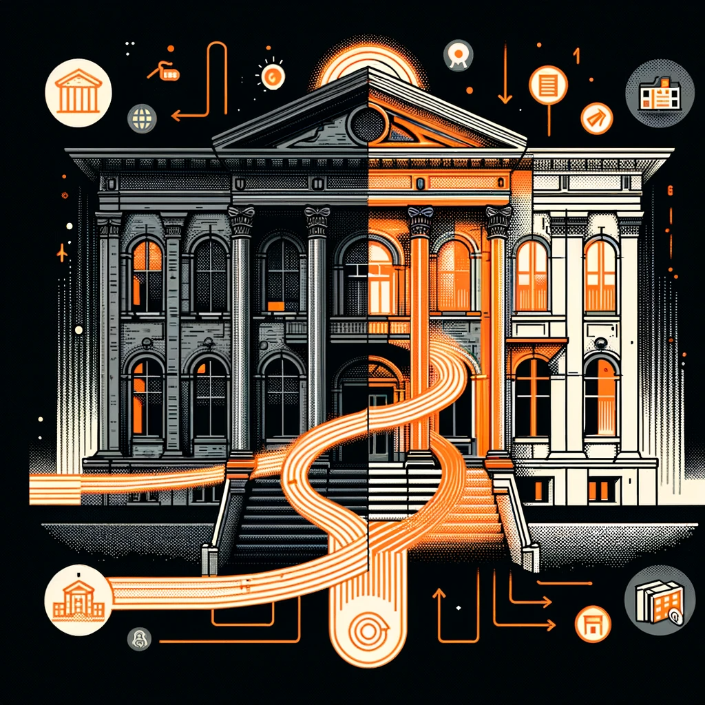

# Conservation / Adaptive Reuse

<figure><figcaption></figcaption></figure>

## What is Conservation?

Conservation refers to the practice of preserving and safeguarding historically significant buildings, structures, and cultural heritage. It involves the protection, restoration, and maintenance of these assets.

### Here are three key aspects of conservation:

#### 1. Historical Significance:

Conservation focuses on preserving the historical value of a building or structure.

Key aspects include:

**a. Authenticity:** Ensuring that the building retains its original form, materials, and architectural features to maintain historical accuracy.

**b. Research and Documentation:** Conducting thorough research on the building's history and documenting its architectural significance to guide restoration efforts.

**c. Heritage Management:** Implementing policies and strategies for the long-term preservation and management of heritage sites.

#### 2. Material Integrity:

Conservation emphasizes the protection and maintenance of the building's materials and structural elements.

**Key aspects include:**

**a. Condition Assessment:** Evaluating the current state of the building's materials, such as stone, wood, or metal, to determine their deterioration and repair needs.

**b. Conservation Treatments:** Employing appropriate techniques and materials for repairing and stabilizing deteriorated elements, ensuring their longevity.

**c. Preventive Maintenance:** Implementing regular inspections and maintenance practices to proactively address issues and prevent further deterioration.

#### 3. Cultural Value

Conservation recognizes the cultural value of a building and its significance to the community. Key aspects include:

**a. Community Engagement:** Involving local communities and stakeholders in the conservation process to foster a sense of ownership and cultural identity.

**b. Adaptive Reuse Opportunities:** Identifying opportunities for adaptive reuse that align with the cultural value of the building and meet the needs of the community.

**c. Education and Interpretation:** Providing educational programs and interpretive materials to raise awareness and understanding of the building's cultural significance.

***

## What about Adaptive Reuse?

Adaptive reuse involves repurposing existing buildings or structures for new functions while preserving their historic or architectural character. It promotes sustainable development and reduces the demand for new construction.

Adaptive reuse aims to transform the building to accommodate new functions.

### **Key aspects**

**a. Feasibility Analysis:** Assessing the suitability of the existing building for the proposed new use, considering factors such as layout, infrastructure, and zoning regulations.

**b. Spatial Reconfiguration:** Adapting the interior layout and spatial organization to meet the functional requirements of the new use while respecting the existing structure.

**c. Accessibility and Safety:** Ensuring that the building meets current accessibility and safety standards through necessary modifications and upgrades.
