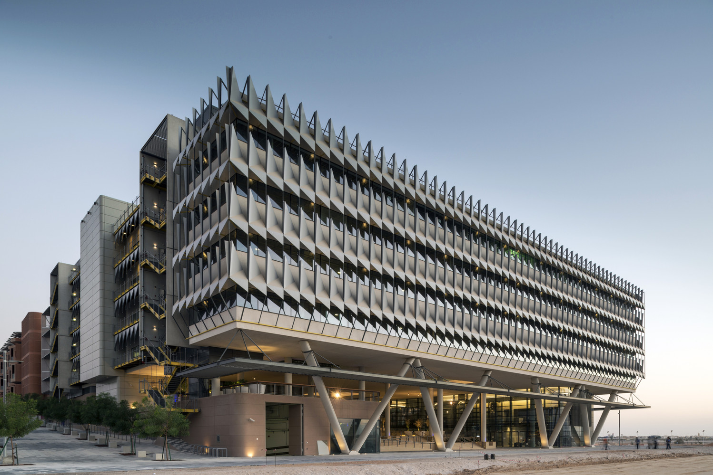

# Parametric Design in Architecture

<figure><figcaption></figcaption></figure>

Parametric design has become more prevalent and important in the design and construction of our buildings. It has been touted as one of the biggest changes architecture will see and how work of an Architect will change in the future.

***

## What is Parametric Design?

Parametric Design is a design process that utilises programming and geometric data inputs and operations to determine design outputs.

To master parametric design, one needs to understand key concepts such as data and parameters, programming concepts & syntax like data structures, functions, conditionals and loops as well the software and tools to get started.

The best way to understand programming is to visualise how to bake a cake. There are inputs, ingredients that you need to process step-by-step. After certain conditions are met, be it after an x amount of time or reaching a certain temperature, a cake is created, the output.

<figure><figcaption>
Parametric Design - Inputs, Function, Outputs
</figcaption></figure>

***

## Why Parametric Design Is Becoming More Relevant?

### 1) Increasingly Data-Centric World

The world is becoming increasingly data-centric.

Architects have access to new types of data becoming available. New technologies and systems such as sensors, 3d photogrammetry/web maps, big data, climatic datasets and passenger ridership data allow for a measurement anything quantifiable.

With this increasing scale of data sets alongside new technology enablers such as machine learning, generative design, computing, Architects  can look forward to have more agency in making design decisions based on relatable data.

These data become new constraints and certain criteria and parameters can be set to govern designs.

By having more parameters to design problems, more realistic constraints (site plan setbacks, plot ratio, height constraints, building layout, facade design, daylighting, computational fluid dynamics) can be implemented to output numerous unexpected solutions.

‍

### 2) Numerous Solutions, Ranked For Our Selection, Allowing Us To Make More Informed Design Decisions

The parametric design process help Architects make informed design decisions through a set of defined conditions, reducing time and cost required to ideate/analyse design ideas.

When design is parametric, the solution can be analysed and ranked. Each solution can be tweaked easily for further analysis, so there is convergence towards a better solution over time and exposure to large precedent datasets.

There will be a clear design methodology towards an agreed solution selection.

***

## What Kinds Of Parametric Design Are There?

### Site Plan Scale

Using generative design to generate 3D massing/site layout design iterations based on site boundary, setbacks, plot ratio.

Constraints such as the site boundary line, building height, GFA, No of storeys etc will need to be input into the system and the system will test as many possible solutions given the parameters.

Once the parameters and goals are in place, we run the generative design simulation to capture as many design solutions that fit the criteria.

As each iteration is recorded, the system will indicate a numeric score. The generative design algorithm follows how nature is, where it will attempt to 'cross breed' two good solutions and/or create new offspring randomly (mutation).

The goal is to keep on finding solutions with the highest score.

Over time, the system will find itself converging towards a set of optimal solutions with similar high scores.

When the system no longer reports better solutions, the simulation can be stopped and we can assess each solution.

**An example of such system is** [**spacemaker.ai**](http://spacemaker.ai/)



### Building Layout

Within the building, plan layout of spaces based on circulation / program proximity based on user preferences in a survey can be inputs into a generative design system to create varied options for further evaluation and implementation.

A project that utilised such design processes is the **Autodesk MaRS Office: Generative Design for Architecture**

An example of a project utilising generative design on a building scale, the Autodesk office in Toronto.

The team behind this project identified key criteria to quantify the design options and rank them.

They include views to outside, adjacency, daylight, distraction etc.

**Learn more about the project:**

[Hands-on with Project Rediscover: Generatively Designing the Autodesk Toronto Office](https://medium.com/autodesk-university/hands-on-with-project-rediscover-generatively-designing-the-autodesk-toronto-office-4c10d78a96d3)



### **Facade Design**

**Siemens Middle East Headquarters** by Sheppard Robson Architects, Abu Dhabi, United Arab Emirates

One example of parametric design being employed in facade design is the Siemens Middle East Headquarters in Abu Dhabi, UAE.

The facade perforation design was based on daylighting requirements of spaces and orientation of building.

Each aluminium panel is calculated and aligned to optimise the shading and view angles for the occupants within the building based on the sun ray direction along the building perimeter.

<figure><figcaption>
Image credit: Paul McMullin
</figcaption></figure>

**Read Artitizer's article on this project for more details:**

[Super Skin: 7 Parametrically Designed Metal Façades - Architizer Journal](https://architizer.com/blog/inspiration/collections/parametrically-designed-metal-facades/)

***

## How To Get Started In Parametric Design?

### 1) Start With Understanding Programming Basics And Generative Design

If you want to get started, I highly recommend you watch my videos on the basics of parametric design and programming basics.

These videos are self guided and are step-by-step with visual explanations for your easy learning.

In these videos, I share about the fundamentals to get started including:

* Types & Application of Parametric Design
* How To Get Started
* Programming Basics
* Data Structures & Syntax
* List Syntax & Methods
* Functions
* Geometry Basics
* Constructing Geometry
* Geometric Operations



### 2) Have A Hands On Visual Programming Tools & Plugins

Use visual programming tools to demonstrate your knowledge as a start.

Here is a list of visual programming parametric design tools as well as plugins for extended uses:

Visual Programming tools (with the respective design software):

* Rhino & Grasshopper
* Revit & Dynamo,
* ArchiCAD & Paramo

If you are completely new, you can read up on the commonly used Rhino-Grasshopper workflow for parametric design via Youtube videos.

* [Nick Senske's Youtube Channel on Rhino and Grasshopper](https://www.youtube.com/user/nsenske/playlists)(these are the videos I used to watch when I was getting started)
* [Grasshopper Primer](https://www.modelab.is/grasshopper-primer/)(Starter guide to the Grasshopper interface)‍

Try out creating your own scripts based on your own problems.

Once you are familiar with the interface, do search for plugins to extend the functionality.

These are my recommended plugins for Grasshopper:

* [Ladybug](https://www.ladybug.tools/) for environmental analysis
* [Elk](https://www.food4rhino.com/en/app/elk) to generate site plans from road maps and building outlines
* [Kangaroo](https://www.food4rhino.com/en/app/kangaroo-physics) for physics, force elemental analysis, catenary structures
* [Galapagos](https://parametrichouse.com/galapagos/) for generative design

‍

### 3) Work Your Way Up

Lastly, once you have achieved a certain level of understanding of parametric design, spend some time to solve simple design problems towards more complex ones.

You should started with parametric form finding and subsequently towards generative design.

Examples of simple design projects you can work on include:

* Furniture design
* Facade patterns/panelisation
* Form finding of skyscrapers, massing.



Examples of complex design problems include:

* Circulation & program organisation based on data inputs
* Building massing and orientation design based on climatic data and view corridors.

***

### Further Reading

* Parametric House - Resourcses for parametric design [https://parametrichouse.com/](https://parametrichouse.com/)
* [Grasshopper Primer](https://www.modelab.is/grasshopper-primer/) (Starter guide to the Grasshopper interface)
