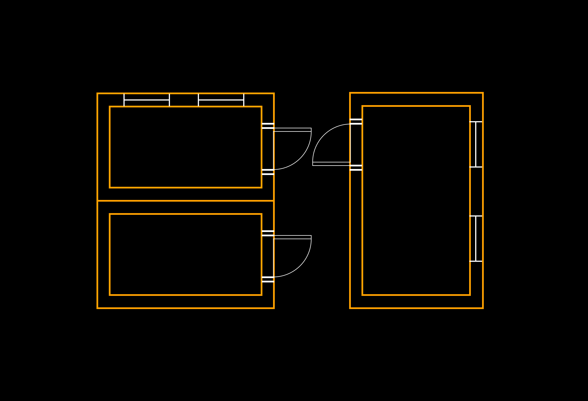

# Plans

<figure><figcaption></figcaption></figure>

Architects come up with plans, drawn at various scales that guide the design, construction, and realization of buildings. I

Here we will delve into the key concepts of scale, proportion of spaces, spatial relationships, and the sequence of spaces as they pertain to architectural plans.

### **1) Drawing to Scale**&#x20;

One of the fundamental aspects of architectural plans is scale. Scale refers to the ratio between the size of the drawing and the actual size of the object it represents.&#x20;

In architectural drawings, we commonly encounter three scales: site layout, building plans, and detail plans.&#x20;

Each scale serves a specific purpose in communicating design ideas effectively.

1. **Site Layout:** Site layout plans provide an overview of the entire project site. They depict the location of the building(s), landscape features, parking areas, and access points. The scale for site plans is typically larger, allowing for a comprehensive view of the entire site, including its context within the surrounding environment. This large-scale view helps architects and stakeholders understand the relationship of the building to its surroundings.
2. **Building Plan:** Building plans, often drawn at a smaller scale than site layouts, focus on the interior and exterior layouts of the structure. These plans show the arrangement of rooms, corridors, and other spaces within the building. Architects pay close attention to scale and proportion to ensure that rooms are comfortable and functional. Proportions, such as ceiling heights and room dimensions, influence the overall feel and functionality of spaces.
3. **Detail Plans:** Detail plans are the most intricate and are typically drawn at a larger scale. They zoom in on specific components of the building, like wall sections, staircases, or plumbing details. Detail plans provide construction teams with precise instructions on how to build intricate elements, ensuring that the final product meets the architect's vision.

### **2) Proportion and Spatial Relationships**

Proportion and spatial relationships are crucial aspects of architectural design.&#x20;

Architects use proportion to create spaces that are aesthetically pleasing and functional.&#x20;

The relationships between spaces within a building can significantly impact the user's experience.

1. **Proportion and Shape of Spaces:** Achieving the right proportions in architectural design is akin to creating a visual harmony. Architects use mathematical ratios and principles of design to determine the size and shape of rooms and elements within them. A well-proportioned space feels balanced and comfortable, while poor proportions can lead to spaces that feel awkward or disorienting.
2. **Spatial Relationships:** How spaces within a building relate to each other is another key consideration. Architects carefully plan the flow and connectivity between spaces to create a functional and pleasant experience for occupants. \
   \
   For example, the sequence of spaces in a residential layout might start with an entry foyer, lead to a living room, and then transition to a dining area, all while maintaining a sense of coherence and progression.

### **3) Sequence of Spaces**

The sequence of spaces is a narrative that unfolds as one moves through a building.&#x20;

Architects use this sequence to control the user's experience and create moments of surprise, excitement, or tranquility.&#x20;

Think of how a grand entrance hall leads to a breathtaking view or how a series of interconnected rooms can enhance the sense of exploration within a museum.

In conclusion, architectural plans are not just technical drawings; they are the manifestation of an architect's vision, considering scale, proportion, spatial relationships, and the sequence of spaces.&#x20;

These plans serve as a roadmap for builders and a means of communication between architects and clients.&#x20;

By mastering these fundamental concepts, architects can create spaces that are not only functional but also beautiful and evocative, enriching the lives of those who inhabit them.
