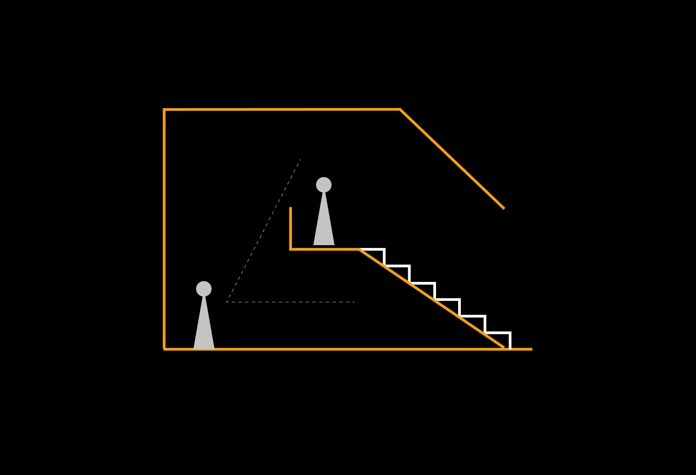

# Sections

<figure><figcaption></figcaption></figure>

In the realm of architectural drawings, sections are a vital tool that allows architects to reveal the intricate vertical relationships within a building.&#x20;

Much like the previous page on architectural plans, sections play a pivotal role in conveying design intent.&#x20;

In this article, we will explore the importance of these elements in architectural sections.

### **1) Key Heights of Spaces**

One of the primary functions of architectural sections is to elucidate the vertical dimension of a building.&#x20;

By depicting the heights of various spaces, sections provide a clear understanding of a building's volumetric composition.&#x20;

These heights include floor-to-ceiling dimensions, mezzanines, balconies, and any other significant vertical elements within the structure.

Architects carefully consider these heights to create spaces that are both functional and aesthetically pleasing.&#x20;

High ceilings can lend a sense of grandeur, while lower ceilings can create cozy, intimate atmospheres.&#x20;

Highlighting these key heights in sections allows both designers and stakeholders to visualize the spatial qualities of the building.

### **2) Vertical Relationships**

Sections are instrumental in portraying the vertical relationships between different levels of a building. This includes depicting staircases, elevators, ramps, and other vertical circulation elements.&#x20;

Understanding how people move through a building vertically is crucial for ensuring accessibility and efficient flow.

Furthermore, sections reveal the connections between various floors and their relationship to each other. For instance, a section may illustrate how a double-height living room on the ground floor connects visually and spatially with a gallery or bridge on the upper level. These vertical relationships contribute to the overall spatial experience within the building.

### **3) Facade Openings and Airwells**

Sections also unveil the intricate details of a building's facade, including window placements, openings, and airwells.&#x20;

These elements have a profound impact on the building's aesthetics, natural lighting, and ventilation.&#x20;

Sections provide a clear view of how these openings align with the interior spaces, emphasizing the importance of views and daylighting strategies in the design.

Airwells, in particular, are essential for ventilation and can serve as vertical gardens or light wells, infusing the building with natural elements and enhancing the overall indoor environment.&#x20;

In essence, sections enable architects and stakeholders to assess the effectiveness of these design features.

***

In conclusion, architectural sections are indispensable tools for architects to communicate the vertical dimension of their designs.&#x20;

These sections provide a holistic view of how a building comes together, ensuring that the design intent is not only expressed on the horizontal plane but also celebrated in the vertical realm.
