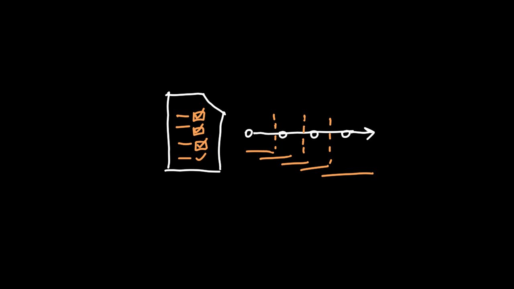

# 04 - Building Project & Contract Administration

<figure><figcaption></figcaption></figure>


[overview-of-contract-administration.md](overview-of-contract-administration.md)



[tender-process-for-a-measurement-contract.md](tender-process-for-a-measurement-contract.md)



[project-management-for-young-architects-from-design-to-completion.md](project-management-for-young-architects-from-design-to-completion.md)

